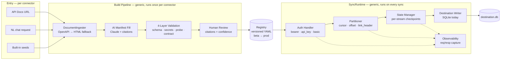
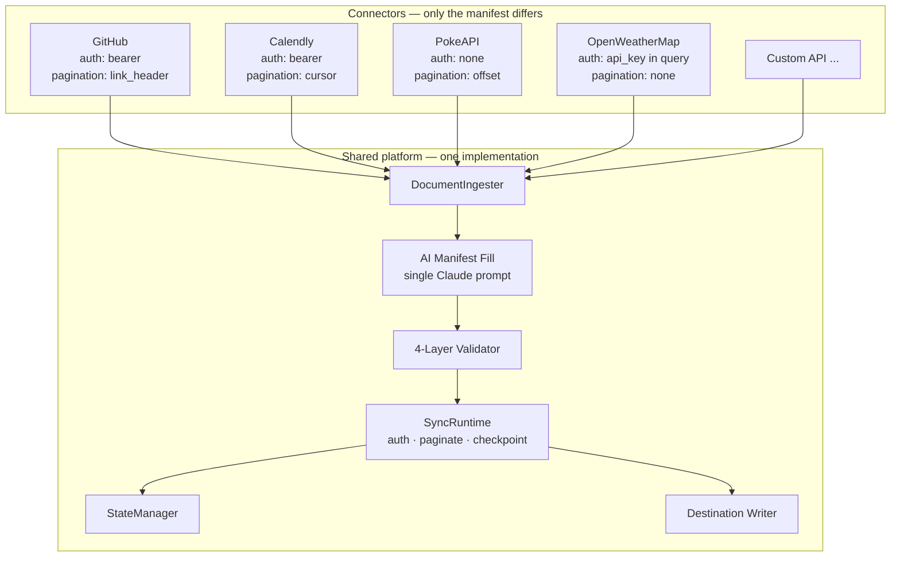

# CloudEagle — AI Custom Connector Builder

A full-stack demo that shows how an AI-powered pipeline can turn any REST API's documentation URL into a versioned, validated data connector — without writing a single line of integration code.

Built as a case study demonstrating a five-layer connector platform architecture: **Doc Ingestion → AI Manifest Fill → 4-Layer Validation → Human Review → Runtime Sync**.

---


## What It Does

1. **AI Builder (Chat)** — Describe the API you want to connect in plain English. The assistant asks clarifying questions (auth type, which streams to sync), then emits a structured build request.
2. **Build Pipeline** — A three-step automated pipeline runs in the background:
   - Fetches the API's OpenAPI spec or scrapes its HTML docs
   - Uses Claude to fill every manifest field with a grounded citation from the source
   - Runs 4 validation layers (schema · secret scan · live API probe · contract test)
3. **Human Review** — You see every AI-filled field with its citation and confidence score. Approve to register the connector.
4. **Connector Registry** — Approved connectors are stored with full version history (beta → production lifecycle).
5. **Runtime Sync** — Registered connectors can be synced on demand. The runtime handles auth, pagination, checkpointing, and writes records to a local SQLite destination.
6. **Observability** — Sync history, per-stream stats, and live request/response debug panel.

---

## System Architecture

CloudEagle is built around a single insight: **every REST connector is the same code path running against a different manifest.** The only thing that changes per connector is a YAML document describing auth, endpoints, and pagination. Every other component — ingestion, AI extraction, validation, runtime, destination — is generic and reused unchanged.

### The reuse boundary: the manifest

The manifest is the contract. Once a connector reaches the registry it looks like this regardless of which API it represents:

```yaml
name: github
base_url: https://api.github.com
auth:    { type: bearer }                     # or api_key (header|query), basic, none
streams:
  - name: repos
    path: /user/repos
    method: GET
    record_selector: $[*]                     # JSONPath into the response
    pagination: { strategy: link_header }     # or cursor | offset | page_number | none
    params: { per_page: 30 }
```

Adding a new connector means producing one of these. It does **not** mean writing new Python.

### Current state — pipeline & component reuse



### How the same components serve every connector

The diagram below shows what is genuinely shared vs. what is connector-specific. The shared column is ~95% of the code; the per-connector column is the manifest plus a handful of small branches (e.g. Calendly's `/users/me` context fetch, GitHub's canonical OpenAPI URL).



**What the runtime dispatches on, not branches on:**

| Dimension | Manifest field | Runtime behavior |
|-----------|---------------|------------------|
| Auth | `auth.type` | `_build_headers()` selects bearer / api_key-header / api_key-query / none |
| Pagination | `pagination.strategy` | `_fetch_page()` selects link_header / cursor / offset / none |
| Record shape | `record_selector` (JSONPath) | `_apply_selector()` extracts records from any JSON shape |
| Destination table | `{connector}_{stream}` | `_create_table()` infers SQL types from first record |
| Checkpoints | `pagination.cursor_field` | `StateManager` persists last cursor per (connector, stream) |

Adding support for a new auth type or pagination strategy is a single dispatch branch — it instantly applies to every connector that declares it in its manifest.

### Future state

The current build covers ingestion → fill → validate → review → registry → sync. The future state extends each layer with the production concerns called out in [Limitations](#limitations-demo-scope):

```mermaid
flowchart LR
    subgraph Entry["Entry"]
        E1[Docs URL]
        E2[NL chat]
        E3[Code import<br/>existing Singer/Airbyte]
    end

    subgraph Build["Build Pipeline"]
        B0[DocumentIngester]
        B1[AI Manifest Fill]
        B2[4-Layer Validation]
        DRAFT[/Draft state<br/>unvalidated/]:::new
        B3[Human Review]
    end

    subgraph Reg["Registry"]
        R[(Versioned manifests)]
        SE[Schema Evolver<br/>auto-migration]:::new
        EXP[Code Export<br/>Singer · Airbyte · Python SDK]:::new
    end

    subgraph Health["Continuous Health Layer"]:::newgroup
        H1[Re-validate<br/>on cron]:::new
        H2[Drift detector]:::new
        H3[Auto-demote<br/>prod → beta]:::new
    end

    subgraph Runtime["Runtime Service"]
        SCHED[Scheduler<br/>cron · event-driven]:::new
        VAULT[Credential Vault<br/>env · secrets-mgr · session]:::new
        POOL[Worker Pool<br/>backpressure]:::new
        RT[SyncRuntime]
        ST[(State<br/>DynamoDB / Postgres)]:::new
    end

    subgraph Dest["Destinations"]
        D1[SQLite]
        D2[Snowflake]:::new
        D3[BigQuery]:::new
        D4[S3 / Iceberg]:::new
    end

    subgraph Tenancy["Multi-tenant"]:::newgroup
        T1[Per-tenant namespace]:::new
        T2[RBAC]:::new
        T3[Audit log]:::new
    end

    E1 & E2 & E3 --> B0 --> B1 --> B2 --> DRAFT --> B3 --> R
    R --> EXP
    R --> SE
    R --> H1 --> H2 --> H3 --> R
    SCHED --> POOL --> RT
    R --> RT
    VAULT --> RT
    RT --> ST
    RT --> D1 & D2 & D3 & D4
    Tenancy -. policies .-> R
    Tenancy -. policies .-> RT

    classDef new fill:#fff4d6,stroke:#d4a017,stroke-width:1px,color:#5a4400
    classDef newgroup fill:#fffaf0,stroke:#d4a017,stroke-dasharray: 4 3
```

Yellow nodes/groups are the additions over the current build. Crucially, **none of them require touching per-connector code** — they all sit at the platform layer and apply uniformly to every connector in the registry. That is the payoff of the manifest-as-contract design.

---

## Tech Stack

| Layer | Technology |
|-------|-----------|
| Backend | Python 3.10+ · FastAPI · Uvicorn |
| AI | Anthropic Claude claude-sonnet-4-6 (via `anthropic` SDK) |
| Frontend | Vanilla JS SPA · Jinja2 template · no build step |
| Storage | JSON files (registry, state, checkpoints) · SQLite (sync destination) |
| Streaming | Server-Sent Events (SSE) for live pipeline and sync progress |
| HTTP | `requests` library for API probing and doc scraping |

---

## Prerequisites

- **Python 3.10 or higher** (tested on 3.11, 3.12, 3.13; 3.14 works with the Jinja2 workaround already applied)
- **pip** (comes with Python)
- **Anthropic API key** — required for the AI manifest fill step. Get one at [console.anthropic.com](https://console.anthropic.com). Without a key the app runs in mock mode using pre-computed GitHub/Calendly manifests.
- **Internet access** — the build pipeline fetches API docs and probes live endpoints.

---

## Setup

### 1. Clone the repository

```bash
git clone https://github.com/mdskmohan/AI-Custom-Connector-Builder.git
cd AI-Custom-Connector-Builder
```

### 2. Create a virtual environment

```bash
python3 -m venv .venv
source .venv/bin/activate        # macOS / Linux
# .venv\Scripts\activate         # Windows
```

### 3. Install dependencies

```bash
pip install -r cloudeagle_demo/requirements.txt
```

### 4. Set your Anthropic API key

**Option A — Shell export (current session only):**
```bash
export ANTHROPIC_API_KEY=sk-ant-...
```

**Option B — Persistent (add to shell profile):**
```bash
echo 'export ANTHROPIC_API_KEY=sk-ant-...' >> ~/.zshrc
source ~/.zshrc
```

**Option C — Via the UI Settings panel:**
After starting the server, click the gear icon (top-right) and enter your key there. It is stored in browser `localStorage` only — never sent to any server other than Anthropic.

> Without an API key the app falls back to mock mode: the build pipeline runs with pre-computed GitHub and Calendly manifests, which is enough to explore the UI end-to-end.

---

## Running the App

```bash
source .venv/bin/activate
uvicorn cloudeagle_demo.web_app:app --reload --port 8000
```

Open **http://localhost:8000** in your browser.

The `--reload` flag hot-reloads the server on file changes — useful during development.

---

## Walkthrough

### Build a custom connector

1. Open the **AI Builder** (the chat interface, opens by default).
2. Type the name of any public REST API, e.g. `PokeAPI` or `OpenWeatherMap`.
3. The assistant will ask which streams you want to sync.
4. After confirmation it emits a build request — click **Start Building** or let it auto-start.
5. Watch the live pipeline in the **Artifacts** panel on the right.
6. Once all 4 validation layers pass, click **Approve** to register the connector.

### Sync data

1. Go to **Connectors** in the left nav.
2. Click **Configure** on any registered connector.
3. Open the **Sync** tab, enter your API credential (if required), and click **Run Sync**.
4. Watch the live log — records are written to `data/destination.db` (SQLite).
5. Use the **Preview / Request / Response / Schema / State** debug tabs to inspect what happened.

### Publish a connector

In the Configure page header, use **Publish** to promote from `beta` to `production`, or **Unpublish** to revert. Delete removes the connector entirely (with confirmation).

---

## Project Structure

```
AI-Custom-Connector-Builder/
├── cloudeagle_demo/
│   ├── web_app.py              # FastAPI app — all routes and SSE endpoints
│   ├── requirements.txt        # Python dependencies
│   ├── core/
│   │   ├── ingestion.py        # OpenAPI parser + HTML scraper
│   │   ├── ai_manifest_fill.py # Claude-powered manifest extraction with citations
│   │   ├── validation.py       # 4-layer validation stack
│   │   ├── registry.py         # JSON-backed connector registry with versioning
│   │   ├── runtime.py          # Sync runtime — auth, pagination, checkpoint, SQLite write
│   │   ├── state.py            # Sync run history, checkpoints, last-request capture
│   │   └── health.py           # Observability helpers
│   ├── templates/
│   │   └── index.html          # Single-page app (vanilla JS + CSS, no build step)
│   └── data/                   # Auto-created at runtime (gitignored)
│       ├── registry.json       # Connector registry
│       ├── state.json          # Sync history and checkpoints
│       └── destination.db      # SQLite sync destination
└── README.md
```

---

## Key Design Decisions

### Why Server-Sent Events for streaming?
Both the build pipeline and sync runtime run in background threads. SSE lets the frontend receive live log lines and progress updates without polling. Each build/sync gets a UUID session ID; the frontend connects to `/api/build/{id}/events` or `/api/sync/{id}/events`.

### Why citations on every AI-filled field?
The manifest fill step uses grounded extraction — Claude is given the raw documentation text and must quote the specific passage that justifies each value it fills. This makes AI output auditable and catches hallucinations before they reach production.

### Why streams are user-selected, not AI-chosen?
The AI reads the docs and can identify all available endpoints. But which streams to sync is a business decision — the chat assistant collects this preference explicitly and injects it into the Claude prompt as a hard constraint (`IMPORTANT: Generate ONLY these streams`). This prevents the AI from silently syncing endpoints the user didn't ask for.

### Why JSON files instead of a database?
This is a demo. The registry and state are intentionally simple JSON files so the project has zero infrastructure dependencies — clone and run. In production these would be DynamoDB / Postgres tables.

### Why vanilla JS with no build step?
Keeping the frontend as a single `index.html` with no bundler means anyone can read the full UI code in one file and run it without `npm install`. The SPA uses a lightweight global state object (`S`) and re-renders page sections on navigation.

---

## API Reference

| Method | Endpoint | Description |
|--------|----------|-------------|
| `GET` | `/` | SPA shell |
| `GET` | `/api/connectors` | List all registered connectors + stats |
| `GET` | `/api/connectors/{name}` | Get single connector with full version history |
| `PUT` | `/api/connectors/{name}` | Update connector manifest / docs |
| `DELETE` | `/api/connectors/{name}` | Delete connector |
| `POST` | `/api/connectors/{name}/promote` | Promote to production |
| `POST` | `/api/connectors/{name}/demote` | Revert to beta |
| `POST` | `/api/build/start` | Start AI build pipeline → returns `build_id` |
| `GET` | `/api/build/{id}/events` | SSE stream for build progress |
| `POST` | `/api/build/{id}/approve` | Approve build and save to registry |
| `POST` | `/api/connectors/{name}/sync` | Start data sync → returns `sync_id` |
| `GET` | `/api/sync/{id}/events` | SSE stream for sync progress |
| `POST` | `/api/test` | Quick connectivity test (auth + base URL probe) |
| `POST` | `/api/probe` | Single URL probe for stream path validation |
| `POST` | `/api/chat` | LLM chat endpoint for AI Builder |
| `GET` | `/api/observability` | Sync history, checkpoints, stats |
| `GET` | `/api/destination/tables` | List SQLite destination tables |
| `GET` | `/api/destination/table/{name}` | Query a destination table (up to 200 rows) |

---

## Environment Variables

| Variable | Required | Description |
|----------|----------|-------------|
| `ANTHROPIC_API_KEY` | No* | Claude API key for AI manifest fill. Falls back to mock mode if not set. |

*The app is fully functional without an API key — mock mode uses pre-computed manifests for GitHub and Calendly.

---

## Limitations (Demo Scope)

| Concern | Demo | Production path |
|---------|------|----------------|
| Sync scheduling | Manual trigger only | Cron / event-driven scheduler |
| Destination | SQLite file | Snowflake, BigQuery, S3, DynamoDB |
| Auth | API key + Bearer | OAuth 2.0, mTLS, Vault-backed secrets |
| Concurrency | Single-threaded sync | Worker pool with backpressure |
| State storage | JSON files | DynamoDB / Postgres |
| Schema evolution | Not handled | Schema Evolver service with migration |
| Draft state | Not implemented — build goes straight to beta | Pre-approval draft stage with AI-generated, unvalidated manifest |
| Continuous health layer | Not implemented | Periodic re-validation against live API; auto-demotion on drift |
| Credential vault | Plain string in sync request | Three-path vault: env var, secrets manager, UI-entered (session-only) |
| Multi-tenant isolation | Single global registry | Per-tenant namespacing, RBAC, audit log |
| Code export | Not implemented | Export connector as Python/Singer tap or Airbyte spec |

This prototype demonstrates the build-time pipeline and runtime service in full. The continuous health layer, credential vault, multi-tenant isolation, and code export features described in the full product strategy are production infrastructure concerns not included here.

